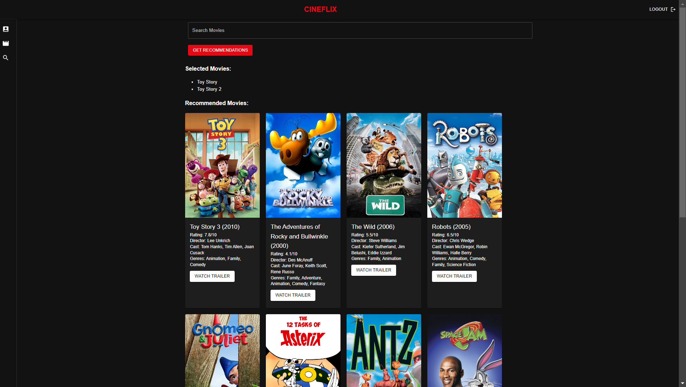
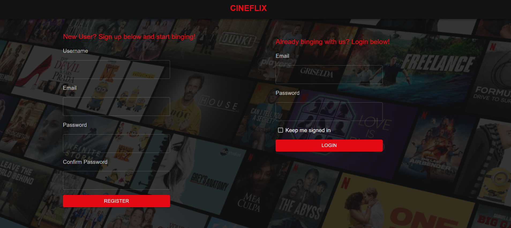

# <i>Movie Recommendation 🎥 </i>

    A collaborative filtering based recommendation engine!

Discover Your Next Movie Night Gem!

<!--  -->

 
 
 
          

<!--  
Tired of endless scrolling, trying to find the perfect movie? 🍿   -->
<!-- ## Sneak peak! :wink: -->
<!--   
   -->

# <b>Contents</b>

- [Introduction](https://github.com/Joshi-Karan/MovieRecommender_Fall24/tree/stableF24?tab=readme-ov-file#introduction-%EF%B8%8F) 
- [What's New in Phase 4?](https://github.com/Joshi-Karan/MovieRecommender_Fall24/tree/stableF24?tab=readme-ov-file#whats-new-in-phase-4) 
- [Future Project Plan](https://github.com/Joshi-Karan/MovieRecommender_Fall24/tree/stableF24?tab=readme-ov-file#future-project-plan-) 
- [Video](https://github.com/Joshi-Karan/MovieRecommender_Fall24/tree/stableF24?tab=readme-ov-file#video-%EF%B8%8F) 
- [Working](https://github.com/Joshi-Karan/MovieRecommender_Fall24/tree/stableF24?tab=readme-ov-file#working-) 
- [Tech Stack](https://github.com/Joshi-Karan/MovieRecommender_Fall24/tree/stableF24?tab=readme-ov-file#tech-stack-used-) 
- [Requirements and Setup](https://github.com/Joshi-Karan/MovieRecommender_Fall24/tree/stableF24?tab=readme-ov-file#requirements-and-setup-%EF%B8%8F) 
- [Usage](https://github.com/Joshi-Karan/MovieRecommender_Fall24/tree/stableF24?tab=readme-ov-file#usage) 
- [Documentation](https://github.com/Joshi-Karan/MovieRecommender_Fall24/tree/stableF24?tab=readme-ov-file#documentation-) 
- [Bug](https://github.com/Joshi-Karan/MovieRecommender_Fall24/tree/stableF24?tab=readme-ov-file#bug-) 
- [License](https://github.com/Joshi-Karan/MovieRecommender_Fall24/tree/stableF24?tab=readme-ov-file#bug-)

## Introduction 👁️

Say hello to our Movie Recommender! 🚀 
Just tell us what type of movies you like, and we'll serve up a handpicked list of must-watch movies tailored to your taste. No more movie-night dilemmas! 🎬 
Save time, ditch the hassle, and let Movie Recommender do the work for you. Movie night has never been this easy and exciting! 🌟 
Your perfect movie is just a click away. Get started now and make every movie night a hit! 👏  

## What's New in Phase 4?
1. An all new React based Frontend for the entire site including new registration, login, home, and account pages!
2. Fixes for the frequent issues of broken poster images and mismatching posters.
3. Optimzied backend to utilize only 1 API ([The Movie Database](https://developer.themoviedb.org/reference/intro/getting-started)).
4. Cast and Director information shown for each movie.
5. Cleaned CSV data files to produce better recommendations and results on the frontend.
6. 60 new Test cases (previously just 19)!
7. Tested expansion of movies and ratings database (see #4 in [Future Project Plan](https://github.com/Joshi-Karan/MovieRecommender_Fall24/tree/stableF24?tab=readme-ov-file#future-project-plan-))

  

## Future Project Plan 🔮

The following changes can take this project to an even greater level:

1. Create page to only display movies of each director, actor, or genre when the name is clicked on.
2. Enhance the user profile page to display liked, disliked, and saved movies in a clean way.
3. Remove search functionality and suggest recommendations on home page based off user likes and dislikes.
4. Phase 4 tested an expansion of the movies.csv and ratings.csv file from 9k movies and 100k ratings to 87k movies and 32M ratings, but did not include because it would be a great opportunity for a future phase to pick up these files from [MovieLens](https://grouplens.org/datasets/movielens/32m/) and figure out the best sampling method to incorporate the new data into the existing code.
5. Improve recommendations response speed.

Note: Our system can be virtually tested through Github Actions inbuilt feature of build and test queries using python.

## Video ▶️ 

[Click here](https://youtu.be/FjBlkBwH2ss) Or click below:

## Working 📱

- Below working displays the system also evaluates movie attributes such as genre, cast, director, and user-generated reviews. 
- By combining these user-specific data and film characteristics, the recommender system employs machine learning to generate tailored movie recommendations.
- This enables users to discover new films that align with their individual tastes, making the movie-watching experience more enjoyable and engaging. 
- Furthermore, recommender systems often employ a feedback loop, where users' interactions and feedback help refine the recommendations over time, ensuring that the suggestions remain relevant.

## Tech stack used 👨‍💻

Python

Python is a high-level, general-purpose programming language known for its simplicity and readability. It is often used to build websites and software, automate tasks, conduct data anaysis and more.

Flask

Flask is a micro web framework written in Python. It's lightweight and easy to use for building web applications, making it a perfect choice for small to medium-sized projects.

React

React is a JavaScript library for building user interfaces!

HTML

HTML (Hypertext Markup Language) is the standard markup language for creating web pages and web applications. It's used for structuring the content on the web.

CSS

CSS (Cascading Style Sheets) is a style sheet language used for describing the look and formatting of a document written in HTML. It's essential for web design and layout.

JavaScript

JavaScript is a versatile and widely used programming language for adding interactivity and dynamic behavior to web pages. It's essential for client-side web development.

## Requirements and Setup ⚙️

- python 3.5 +
- pip
- Style check  - black
    `pip install black`
- Static code analyser - Pylance
    `Install it in VS Code`

- Install all required python packages
    `pip install -r requirements.txt `

## Usage
To run Flask backend:
1. `cd Code/recommenderapp`
2. `python3 app.py`

To run React frontend:
1. cd Code/frontend
2. npm start

## Follow these steps to run our project on your system! 🔮
1. Clone the project onto your system.
2. Incluse an api_key.txt file with the api key for the movie API and store it in a .env file on your computer - Take a look at this link: (https://developer.themoviedb.org/reference/intro/getting-started).
3. Install the following packages:
   
   a. `pip install flask-sqlalchemy`

   b. `pip install flask-bcrypt`

   c. `pip install flask-login`

   d. `pip install flask-wtf`

   e. `pip install email-validator`
   
5. Follow these steps to create the database -> Execute in python terminal:
 
   a. `from movierecommender import db`
   
   b. `from movierecommender.models import User,Post`
   
   c. `db.create_all()`
   
7. Run the backend and frontend.

## Documentation 📚
Refer to Wiki page [here](https://github.com/Joshi-Karan/MovieRecommender_Fall24/wiki)

## Bug? 🐛
Raise a issue on this repository, we would love to look at it ❤️
You also have the option of contacting us:
- avchundi@ncsu.edu
- kjoshi5@ncsu.edu
- rhosadu@ncsu.edu

## License 📃
This project is under MIT License.
- The MIT license explicitly grants users the right to reuse code for various purposes,hence for improval of future scope of the code we have added MIT license.
- They include the original MIT license when distributing it. Allowing users to customize or adapt the code to meet their specific requirements.

## Need Help?
Contact us at helpcineflix@gmail.com for any query.

## Preferred Citation
Ajay, Karan, Ruthwik (2024, October 31). CINEFLIX: A movie recommendation system. GitHub. <https://github.com/Joshi-Karan/MovieRecommender_Fall24/tree/stableF24>

